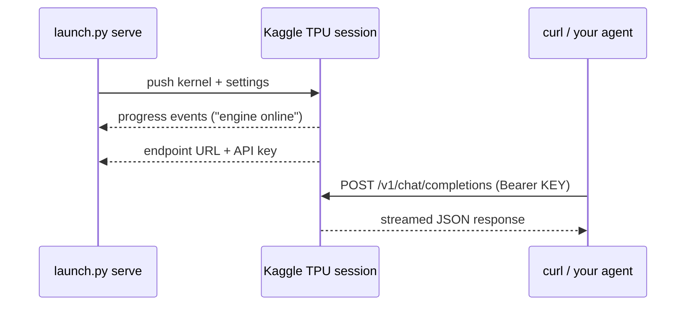
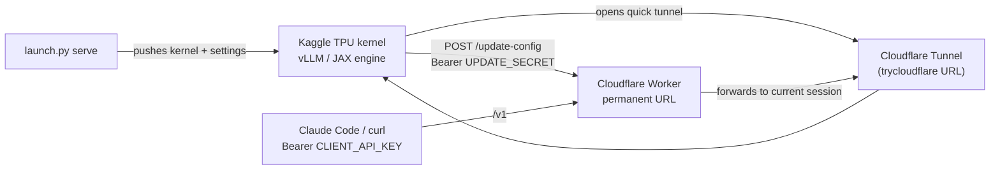

# kaggle-llm-endpoint

Run frontier-class open models on Kaggle's **free TPU v5e-8** and get a public
endpoint that speaks the **OpenAI and Anthropic APIs**. Point Claude Code,
Codex CLI, opencode or plain `curl` at it. No GPU, no cloud bill — about
twenty minutes from pressing Run to a live URL.

## What's in this fork

Built on [ARahim3/kaggle-tpu-lab](https://github.com/ARahim3/kaggle-tpu-lab)
(the original project handles a single model with a fresh URL per boot).
Additions here:

- **Multi-model launcher** — `python launch.py serve --model qwen|glm`;
  supports both models with per-model flags.
- **GLM-5.3-Flash packaging** — run-all notebook + kernel + a custom JAX
  engine, auto-embedded at launch time.
- **Permanent-URL relay** — the `worker/` Cloudflare Worker keeps one stable
  endpoint across reboots, so agent settings never change.
- **Guided setup wizard + doctor** — `python launch.py setup` walks a fresh
  machine from clone to a tested endpoint (8 idempotent, resumable steps with
  four approvals and browser/token logins); `python launch.py doctor` is a
  read-only health report with fix hints, safe to paste into bug reports.
- **One config file** — everything durable (Kaggle username, worker name,
  relay URL, the two relay secrets, per-step progress) lives atomically in
  `~/.ktl/config.json` (0600 file in a 0700 dir); the per-boot API key never
  touches it.
- **Encrypted at-rest relay session** — the Worker seals the stored session
  (tunnel URL + per-boot key) with **AES-256-GCM**, the key derived from
  `UPDATE_SECRET` via **HKDF-SHA256**, so a Durable Object or backup leak
  never yields your live endpoint key (details under Security).
- **Qwen reliability patches** — spec-decode MTP rollback and an immutable
  draft-row fix (async + MTP + structured-outputs crash) baked into the
  served kernel.

## Models

| Model | Weights on the TPU | Context | One stream | Many streams | Prefill | Run → URL | Engine |
|-------|--------------------|---------|------------|--------------|---------|-----------|--------|
| [Qwen3.8-27B](launcher/qwen38-27b/) | bf16, no quantization | 262k | ~130 tok/s | ~540 tok/s at 8 | 10,300 tok/s | ~22 min | vllm-tpu + one patch |
| [GLM-5.3-Flash](launcher/glm53-flash/) (320B MoE) | 3-bit experts, int8 rest | 262k | ~64 tok/s | ~90 tok/s at 3 | ~1,600 tok/s | ~16 min | custom JAX engine |

Each model folder has a run-all Kaggle notebook, the kernel script behind it,
and a README with the numbers and the how.

**Exact model names for API calls** (use these in the `"model"` field or
`ANTHROPIC_MODEL`):

| Model | `"model"` value |
|-------|-----------------|
| Qwen3.8-27B | `qwen3.8-27b` |
| GLM-5.3-Flash | `glm-5.3-flash` |

Example:
```bash
curl <ENDPOINT>/v1/chat/completions -H "Authorization: Bearer <KEY>" \
  -H "Content-Type: application/json" \
  -d '{"model": "qwen3.8-27b", "messages": [{"role": "user", "content": "Hello!"}]}'
```

## What you need

- A **Kaggle account** with phone verification (required for TPU access) and
  its free quota (~20 TPU hours/week).
- **Python 3.10+** and the Kaggle CLI:
  ```bash
  pip install kaggle
  ```
  Get your token at kaggle.com → Settings → API → **Create New Token**, then:
  - **Linux / macOS:** `~/.kaggle/kaggle.json`
    ```bash
    mkdir -p ~/.kaggle && mv ~/Downloads/kaggle.json ~/.kaggle/kaggle.json
    chmod 600 ~/.kaggle/kaggle.json
    ```
  - **Windows:** `%USERPROFILE%\.kaggle\kaggle.json`
- *(optional)* A free **Cloudflare account** + Node.js/npm for the permanent
  URL relay (see below). Without it you get a new random URL each boot.

## Quick start

```bash
cd launcher

python launch.py setup
```

`setup` walks a fresh machine end-to-end: prerequisites → Kaggle login →
Cloudflare Worker (your permanent URL) → generated secrets → TPU session →
live compatibility test → your AI clients. Every step is idempotent and
resumable; you approve four moments (deploy the Worker, confirm the URL,
start the TPU session, configure your clients). When it finishes, the
compatibility matrix is green and your clients point at a permanent URL.

```bash
python launch.py doctor                 # read-only health report, safe to paste
python launch.py serve                  # (re)start the TPU session — Qwen3.8-27B (default)
python launch.py serve --model glm      # GLM-5.3-Flash (engine auto-embedded)
```

`serve` pushes the kernel, watches progress live, and registers the session
with your relay when it's ready. Prefer to do it all by hand (token, wrangler,
direct mode)? The full manual path lives in
[docs/setup-manual.md](docs/setup-manual.md).



## Useful commands

```bash
python launch.py setup                  # guided install (fresh machine -> tested endpoint)
python launch.py doctor                 # read-only health report (exit 0 = healthy)

python launch.py status --follow        # re-attach / follow a running session
python launch.py stop                   # terminate the TPU session

python launch.py serve --model glm --reasoning-effort high --streams 8 --vision false
python launch.py serve --model qwen --text-only --fast-start
```

`setup` flags worth knowing: `--dry-run` (print every action, change nothing),
`--only <step>` (redo one step: `prereqs|kaggle|cloudflare|secrets|worker|serve|verify|clients`),
`--adopt-worker <URL>` (point at a Worker you already deployed),
`--rotate` (regenerate the relay secrets), `--reset` (wipe the config, keep the Worker).

## Where your config lives

`setup` keeps its state in **`~/.ktl/config.json`** (override the directory with
`KTL_HOME`). The file is written atomically, `chmod 600`, in a `0700` directory
(on POSIX). Redacted actions are appended to `~/.ktl/setup.log`.

| Stored in `config.json` | **Never** stored there |
|--------------------------|------------------------|
| Kaggle **username** (for kernel slugs) | Kaggle token / credentials (stay in `~/.kaggle/`) |
| Worker name + permanent relay URL | Direct-session API key (changes per boot; in `~/.kaggle-tpu-lab.json`) |
| `client_api_key` + `update_secret` (the two relay secrets) | Anything beyond the two relay secrets |
| Per-step progress (`steps`) | |

Reset / rotate:
```bash
python launch.py setup --reset                    # delete config.json (Worker kept)
python launch.py setup --only secrets --rotate    # new relay secrets (with approval)
python launch.py env --restore opencode           # restore a client's pre-setup config
```

## Project structure

```
kaggle-llm-endpoint/                # repo root
├── launcher/                       # CLI launcher + per-model recipes
│   ├── launch.py                   #   thin CLI dispatcher (entry point)
│   ├── ktl_common.py               #   config file, keys, redaction, prompts, subprocess
│   ├── ktl_serve.py                #   kernel build/push, relay registration, status/stop
│   ├── ktl_env.py                  #   AI-client config generator + compatibility matrix
│   ├── ktl_setup.py                #   guided setup wizard + doctor
│   ├── tests/                      #   offline unittest suite (no network)
│   ├── qwen38-27b/                 #   kernel, notebook, vllm patches, tools
│   ├── glm53-flash/                #   kernel, notebook, JAX engine, tools
│   └── tools/                      #   shared packaging helpers (pack_notebook.py, …)
├── worker/                         # permanent-URL relay (Cloudflare Worker)
├── docs/                           # setup-manual, clients, verification notes
├── README.md                       # this file
└── LICENSE.md
```

| Flag | Model | Effect |
|------|-------|--------|
| `--model qwen\|glm` | both | which model (default: qwen) |
| `--reasoning-effort` | both | server-side default effort |
| `--max-model-len` | both | context length (default 262144) |
| `--streams` / `--vision` | GLM | concurrent streams / vision tower |
| `--max-num-seqs` / `--mtp` / `--text-only` / `--no-tools` / `--fast-start` | Qwen | concurrency, spec-decode, vision, tools, precompile |
| `--keepalive-min 360` | both | auto-shutdown timer (default 480 ≈ 8 h) |

## Permanent URL (optional, ~15 min one-time)

The quick tunnel gets a new `trycloudflare.com` URL every boot. The
`worker/` folder deploys a Cloudflare Worker that keeps **one permanent URL**
pointed at the current session — every future `serve` auto-registers, so your
agent settings never change.

**`python launch.py setup` does all of this for you** (deploys the Worker,
generates both secrets, saves the URL to `~/.ktl/config.json`). Doing it by
hand: see [docs/setup-manual.md](docs/setup-manual.md#permanent-url-relay-by-hand) —
the short version is `cd worker && wrangler login && wrangler deploy`, then
`wrangler secret put` for `UPDATE_SECRET` (used by launch.py) and
`CLIENT_API_KEY` (a different random string, used by your clients), then
`export KTL_RELAY_URL=...` + `KTL_RELAY_UPDATE_SECRET=...`.

Point your tools at it. The easiest way is the `env` command, which prints —
and can write — the exact config for each client (it reads the URL/key you
just set, and knows which key each mode uses):

```bash
python launch.py env all                     # print config for every client
python launch.py env claude-code --write     # write ~/.claude/settings.json
python launch.py env --test                  # live compatibility check
```

If you'd rather set it by hand, note the **base-URL rule** (this trips people
up): the key is always `CLIENT_API_KEY`, but the base URL differs by API.

- **Claude Code** (Anthropic Messages) uses the **root — no `/v1`**; Claude
  appends `/v1/messages` itself:
  ```bash
  ANTHROPIC_BASE_URL=$KTL_RELAY_URL ANTHROPIC_AUTH_TOKEN=<CLIENT_API_KEY> \
  ANTHROPIC_MODEL=glm-5.3-flash claude
  ```
- **OpenAI-compatible clients** (Codex, opencode, aider, Hermes, the OpenAI
  SDK) use the **root + `/v1`**:
   ```bash
   export OPENAI_BASE_URL="$KTL_RELAY_URL/v1"
   export OPENAI_API_KEY="<CLIENT_API_KEY>"
   ```
   (aider is the exception — it reads `OPENAI_API_BASE` and wants the model as
   `openai/<id>`; `env aider` emits the exact lines.)

## Connect your tools

`python launch.py env <client>` generates ready-to-paste config for each of
these. `--write` writes the file (with a `.ktl-bak-*` backup); `--dry-run`
shows the diff; `--test` runs the compatibility matrix (exit `0` all pass, `1`
some fail, `2` unreachable/auth, `3` still booting).

**Config** — what `env <client>` emits / `--write` writes, and whether the
format was checked against a live doc this cycle (2026-09-29):

| Client | Config | Base URL | Key | Format status |
|--------|--------|----------|-----|---------------|
| Claude Code | `~/.claude/settings.json` (`env` object) | root, **no `/v1`** | `CLIENT_API_KEY` (Bearer) | **VERIFIED** (live docs) |
| Codex CLI | `~/.codex/config.toml` (managed block) | root + `/v1` | env `KTL_CLIENT_API_KEY` | **VERIFIED** (official reference) |
| opencode | `~/.config/opencode/opencode.json` (`provider.kaggle-tpu`) | root + `/v1` | `CLIENT_API_KEY` (file) | **VERIFIED** (live docs) |
| Hermes | `~/.hermes/.env` (key) + `model:` block in `~/.hermes/config.yaml` | root + `/v1` | `KTL_CLIENT_API_KEY` (env, `${...}`-ref in YAML) | **VERIFIED** (installed source) |
| aider | print-only (no file) | root + `/v1` | `OPENAI_API_KEY` | **VERIFIED** (official docs) |
| curl | print-only (OpenAI + Anthropic) | `/v1` (both) | `CLIENT_API_KEY` | INFERRED (trivial) |
| Python | print-only (OpenAI + Anthropic SDK) | `/v1` (OpenAI) / root (Anthropic) | `CLIENT_API_KEY` | INFERRED (standard) |

**Compatibility** — a correct config still needs the backend to serve the
route the client calls. From `--test` (GLM reflects source-confirmed routes;
Qwen reflects vLLM — confirm Qwen with a live `--test`):

| Client | Route it needs | Qwen | GLM |
|--------|----------------|------|-----|
| Claude Code | `/v1/messages` | ✓ | ✓ |
| Codex CLI | `/v1/responses` | expected ¹ | ✗ **not supported** |
| opencode | `/v1/chat/completions`, `/v1/models` | ✓ | ✓ |
| Hermes | `/v1/chat/completions`, `/v1/models` | ✓ | ✓ |
| aider | `/v1/chat/completions` | ✓ | ✓ |
| curl / Python (OpenAI) | `/v1/chat/completions` | ✓ | ✓ |
| curl / Python (Anthropic) | `/v1/messages` | ✓ | ✓ |

¹ vLLM serves the Responses API, but that row is mock-confirmed only — run
`python launch.py env --test --model qwen` against a live session to lock it in.
**Codex does not work with GLM**: the GLM engine returns `404` for
`/v1/responses` (source-confirmed in `serve_glm53.py`), so `env codex --model
glm` prints a clear warning instead of a config that won't work.

Secrets are emitted as an `$KTL_CLIENT_API_KEY` reference by default; `--reveal`
embeds the literal (file writes are `chmod 600` and never clobber a key that is
already in the file). Full per-client details, the raw `--test` matrices, and
verification dates: [docs/clients-verification.md](docs/clients-verification.md)
and [docs/clients.md](docs/clients.md).

## How a session works

`launch.py` injects your settings into the kernel script and pushes it; the
kernel attaches the public datasets, builds the engine on the 8 chips, opens
the tunnel, and serves until `keepalive_min` elapses (~9 h max per Kaggle's
cap). Boot again for a fresh session and URL.



The worker stores the latest tunnel URL, so the permanent endpoint always
points at the current boot.

## Troubleshooting (quick hits)

- **No "Relay updated" line** — check env vars are loaded: `echo $KTL_RELAY_URL $KTL_RELAY_UPDATE_SECRET`.
- **401 from the relay** — you must send `CLIENT_API_KEY`, not the other two secrets.
- **502/504 on chat** — registration is fine, the model is still booting. Wait for READY.
- **GLM fails at "no glm53/ package"** — your `launch.py` is outdated; pull latest.
- **Kernel died / 9 h cap** — just `serve` again; relay auto-updates.
- **More relay issues** — see the full section in `git history` or run `cd worker && wrangler tail`.

## Local verification (no TPU needed)

```bash
launcher/glm53-flash/tools/verify_local.sh          # launcher check + kernel smoke test
launcher/glm53-flash/tools/verify_local.sh --full   # + engine unit tests (slow)
```

## Adding a model

One folder inside `launcher/` named after the model: `README.md`,
`kernel/` (serving script with the `__LAUNCHER_CONFIG__` line), `notebook/`,
plus whatever the recipe needs. Then add an entry to `MODELS` in
`ktl_common.py` (shared by serve, env, and setup).

## Security

- The endpoint is **publicly reachable** through a Cloudflare tunnel,
  protected by an API key plus per-window rate limiting. The Worker accepts
  the key as `Authorization: Bearer <key>` (Claude Code, OpenAI SDK, curl) or
  `x-api-key: <key>` (Anthropic SDK clients) and compares keys as SHA-256
  digests in constant time. Both relay secrets must be **at least 32 chars** —
  a shorter one is treated as misconfigured and every request is denied.
- **Never commit** `kaggle.json`, `KTL_API_KEY`, `UPDATE_SECRET`, or
  `CLIENT_API_KEY`.
- Use long random relay secrets (e.g. `openssl rand -hex 32`, 64 chars).
- If a key leaks: rotate it with `wrangler secret put CLIENT_API_KEY`, then
  restart the session with `python launch.py stop` followed by `serve`.
- **Rate limiting: yes, on generation calls.** The Worker counts
  `POST /v1/chat/completions`, `POST /v1/messages`, and `POST /v1/responses`
  (after auth, per 60 s window, at request start) and returns `429` with
  `Retry-After` in the matching API's error shape beyond **120 req/min** —
  the default; set `RATE_LIMIT_PER_MIN` in `worker/wrangler.jsonc` to change
  it. Side calls (`/v1/models`, token counting, health checks) don't count.
  A single agent sits far below the limit; it trips on leaked keys, retry
  storms, or many parallel agents.
- **Concurrency is capped by the engine, not the relay.** GLM runs
  `--streams` decodes plus a bounded wait queue (429 when full, 503 after
  ~90 s of waiting); Qwen caps at `--max-num-seqs` and vLLM's scheduler
  queues the rest.
- **At-rest key encryption.** The stored session (tunnel URL + API key) is
  sealed with **AES-256-GCM** before it reaches the Durable Object; the key
  is derived from `UPDATE_SECRET` via **HKDF-SHA256** — no third secret. Each
  value is bound to its field via GCM AAD, so a stored value can't be swapped
  into the other slot. Rotating `UPDATE_SECRET` makes the stored config
  unreadable until the next `serve` re-registers.
- **Honest threat model.** The Worker must hold the decrypted key in memory
  while forwarding, and Cloudflare terminates TLS at its edge — so the relay
  sees prompts in plaintext and the platform sees traffic. What at-rest
  encryption buys: a Durable Object storage or backup leak no longer yields
  your live endpoint key. What it does **not** cover: a compromised Worker
  (account or code) or Cloudflare itself. If that level of exposure is
  unacceptable, don't run a public relay — use a private named tunnel instead.
- **Logging:** the Worker itself logs nothing (only Cloudflare's standard
  dashboard metrics). The kernel writes everything the server prints —
  including request content — to `vllm.log` in the Kaggle session's working
  directory. That stays private unless you share kernel output.
- Prompts and responses pass through Cloudflare and Kaggle infrastructure.
  Don't send secrets or private data you wouldn't put on a third-party
  service.

## Limits and terms

- Kaggle's free TPU quota is roughly **20 hours/week** and sessions cap at
  ~9 hours (the kernel's `keepalive_min` defaults to 8 h for that reason).
- Check [Kaggle's Terms of Use](https://www.kaggle.com/terms) before use.
  Running a publicly exposed service on free notebook compute may be
  restricted, and accounts can be limited for misuse. You are responsible
  for compliance.
- This is intended for **personal development and experimentation**, not
  production traffic.
- Model weights are subject to their own licenses (see each model folder).

## Credits

- [ARahim3/kaggle-tpu-lab](https://github.com/ARahim3/kaggle-tpu-lab) — the
  original project: Qwen3.8-27B on vllm-tpu, the GLM-5.3-Flash JAX engine,
  and the Kaggle TPU serving infrastructure.
- [ntfy.sh](https://ntfy.sh) for progress events between kernel and launcher.

## License

MIT (see [LICENSE.md](LICENSE.md)). Model weights keep their own licenses;
each folder says which.
